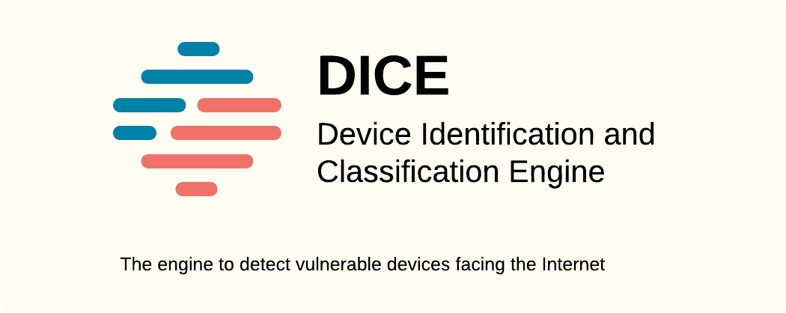

<p align="center">



</p>

<div align="center">

[The Engine](docs/the_engine.md) |
[FAQ](docs/faq.md) |
[Contact](docs/contact.md)

[Commands](docs/commands.md) |
[Features](docs/features.md) |
[Roadmap](docs/roadmap.md) |
[Developer Guide](docs/dev.md)

</div>

DICE is an engine to help orchestrating network measurements.
At the core, DICE falls into the category of vulnerability identification.
It was first thought as a tool for Internet surveys and monitoring networks, a far broader scope than single host scanning.
However, DICE can be used at many different levels.
It's main purpose is to provide flexibility for as many measurements as you can think of.

> [!TIP]
> Got an idea? need a feature? found a bug? [open an issue!](github.com/RicYaben/dice/issues)

__Table of Conent__

1. [Installation](#installation)
2. [Quickstart](#quickstart)
3. [Basic Usage](#basic-usage)
4. [Advanced Usage](#advanced-usage)

# USAGE

Here you can find a quick guide to intall and start using DICE.

> __Note:__ as an engine to orchestrate measurements, use cases may vary greatly.
For simpler measurements (e.g., simple SYN-ACK scans), DICE may be an overkill.
Check out our [frequently asked questions](docs/faq.md) to figure what DICE can do for you.

## Installation

1. __Download DICE's latest release__ using curl or the link on [DICE's github page](https://github.com/RicYaben/dice/releases)

    ```sh
    curl -OL https://github.com/RicYaben/dice/releases/download/latest/dice.linux-amd64.tar.gz
    ```

2. __Remove any previous DICE installation__ by deleting the /usr/local/dice folder, and extract the new installation

    ```sh
    rm -rf /usr/local/dice && tar -C /usr/local -xzf dice.linux-amd64.tar.gz
    ```

3. Add dice to your PATH environment variable

    Add the following line to your `$HOME/.profile` file.
    __Note:__ this file may be located or named differently depending on your environment and terminal.

    ```sh
    export PATH=$PATH:usr/local/dice/bin
    ```

4. Verify you have installed DICE.

    ```sh
    dice version
    ```

## Quickstart

1. __Create a DICE project__ in the current directory

    The first time running this command, DICE will setup dependancies, databases, configurations, etc.
    Then, DICE will create a `.dice` file with the project configuration.

    ```sh
    # Initialize a project
    dice init d1
    ```

2. __Run DICE__ with modules or signatures

    Using DICE to orchestrate Internet-wide measurements is as simple as using the `scan` command with modules (`-M`) or signatures (`-S`).
    Once the measurement is done, you can check the results under the newly created measurement -- check the output logs to find the ID if you did not provide one, -- in the __sources__ directory, or directly from the results `cosmos.db`.

    __Note:__ Learn more about DICE measurement results [cosmos databases here](docs/cosmos.md)

    ```sh
    # Scan the whole IPv4 with a module
    dice scan -M mqtt-anon
    ```

    To list all known to DICE use the following command:

    ```sh
    # Syntaxt to list (all) modules, signatures, or projects
    dice list [-M modules | -S signatures | -P projects] [--all]
    ```

    For more information on DICE's commands and configuration options check out [the list of commands](docs/commands.md).

3. __Query DICE's results__

    ```sh
    # Query the results of a measurement
    dice query 'certificate.hash:029af973ce92ac14dee1a2d8dbaf0c6a' s1/cosmos.db
    ```

## Basic Usage

To start using DICE, we only need to tell the engine which actions we want to use, and which modules or signatures to load.

__Note:__ You do not need to initialize a new project to start using DICE, although, it is highly recommended.

```bash
# Scan the whole IPv4 using a single signature
dice scan -S router
```

This will output the results to the current directory.
You should see a structure containing (at the very least) a sources folder containing results from the different sources and scanners (e.g., ZGrab2, Censys, Shodan, Greynoise, etc.), and a `cosmos.db` with DICE results.

```text
$ ls -lah
sources         // scanning raw results
sources/zgrab2  // zgrab2 results
sources/zmap    // zmap results
cosmos.db       // results database
```

However, DICE can do much more, and as with many other tools, the simplest and most common cases, are only the beggining.
Big part of measurements and network analysis is the ability to replay results, and as such, DICE includes commands to ingest data from different sources and classify using a set of modules or full signatures.
This allows for predictive and deterministic results, helping to share and compare processing pipelines and metrics.

```bash
# Classify previously collected zgrab2 records using all signatures 
# that start with "iot-" or "ot-" 
dice classify -S "iot-*,ot-*" --source zgrab2 
```

This command shows how we would classify previously-collected results with a set of signatures.

## Advanced Usage

We have covered the tip of the iceberg, simple scans, simple classifications.
Here we cover DICE more in depth, and showcase other use-cases more interesting for tinkers and those looking to conduct or evaluate complex measurements.

### Local signatures

We can use DICE with local signatures without registering them into the main database using the `--local` flag.
This will effectively create an in-memory copy of the main database and register the local signature and mentioned modules.
It is particularly useful during the latest stages experimenting of developing signatures.
Most will use this mode in one-off measurements and testing environments.

__Note:__ This mode requires the signature to pointing to modules using relative paths.

```sh
# Temporarily run DICE with a local signature
dice scan -S local-sig.dice --local  
```

### Override arguments

We can also pass environment variables as values for module or signature arguments.

```sh
# Use variables as arguments for modules
dice scan -M telnet-brute --module-args 'dictionary=$(cat dict.pass)'
```

### Layer measurements

There are occasions where we need to layer measurements with different signatures.
DICE can layer measurements as a sequence.

```sh
# Scan for healthcare devices and then for iot devices
dice scan -S healthcare --layer=1 -S iot --layer=2
```
