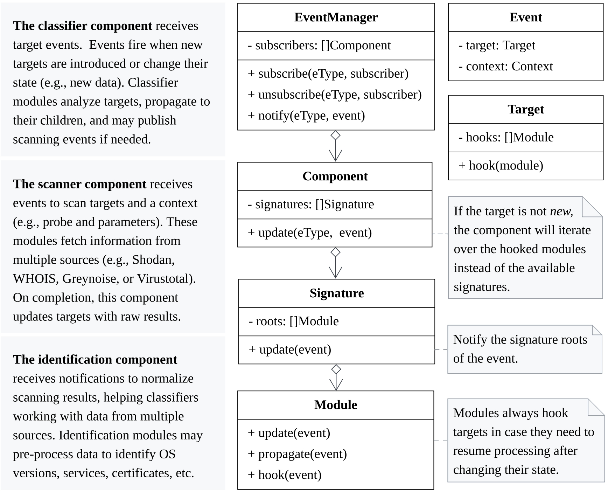

# DICE: The Engine

## Design

DICE's architecture can be drawn as a hierarchy following the observer pattern.
There is a centralized emitter (the engine itself), components subscribed to the engine that define how to deal with events, signatures that organize how to propagate events, and modules that deal with events.



### Components

DICE splits measurement phases into components.
By default, DICE includes three basic components for common tasks: __Scanning__, __Identification__ and __Classification__.
They work simultaneously and are supervised by the engine itself.
Each component defines its own behavior on how to consume and propagate events.

### Signatures

 DICE register signatures in a shared database located in [DICE's data folder](configuration.md).
This database includes references to the actual signatures and serve as a quick map to validated and known signatures.
Registering a signature requires the referenced modules to be accessible, as DICE will read some values to determine relationships and dependancies.
Those modules must be available at runtime, and are evaluated against the hash value when they were first registered.
If the referenced modules have changed, DICE will throw an error.
This means that making changes to modules or signatures will require users to update the database, or telling DICE to start from an empty database. [Learn more about signatures here](signatures.md)

```bash
// Update signatures database
dice update -S
// Use without database
dice scan -S iot --no-cache
```

### Modules

Modules are processing units that communicate over RPC with the main engine -- they are plugins.
Modules receive objects from their parent components or from propagating modules.
Depending on their parent component, modules have different access policies to retrieve or create new objects, such as labels, fingerprints, or new scans.
Whenever a new object is created or updated, an event fires.
Lastly, some modules can hook hosts. Hooks allows DICE to notify modules directly when a host updates with new fingerprints or labels.

## Structure

### Projects

To organize measurements and studies, we can create DICE projects.
Using projects we can maintain the state for scans, share a common configuration for each project, etc.
We view projects as the root for studies under a common set of conditions, e.g., a study that runs for the next 6 months where we will conduct recurrent scans every 2 weeks with the same parameters.

### Cosmos

DICE outputs results to standalone SQLite databases called __cosmos__.
Each cosmos database is related to a DICE run.
